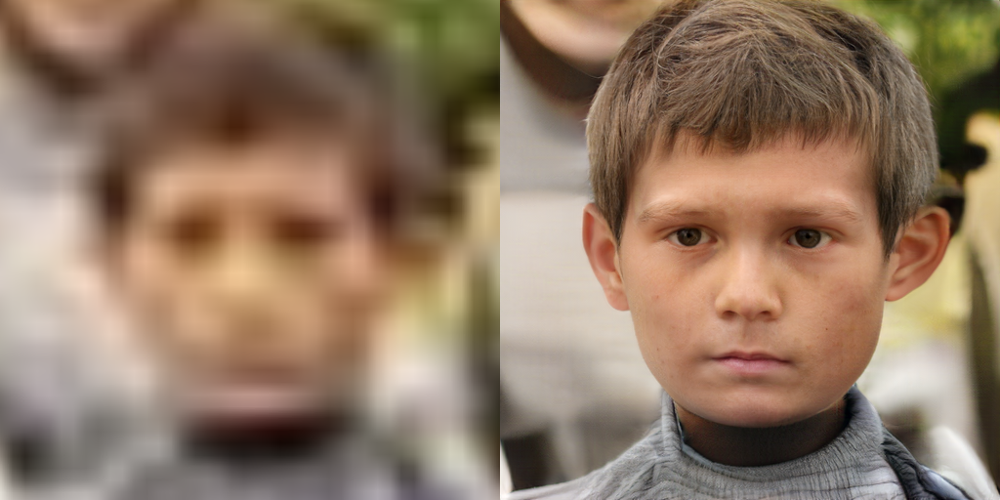
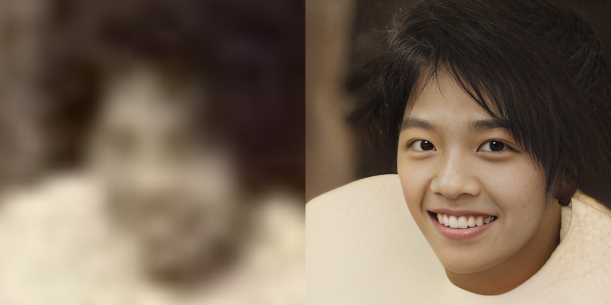
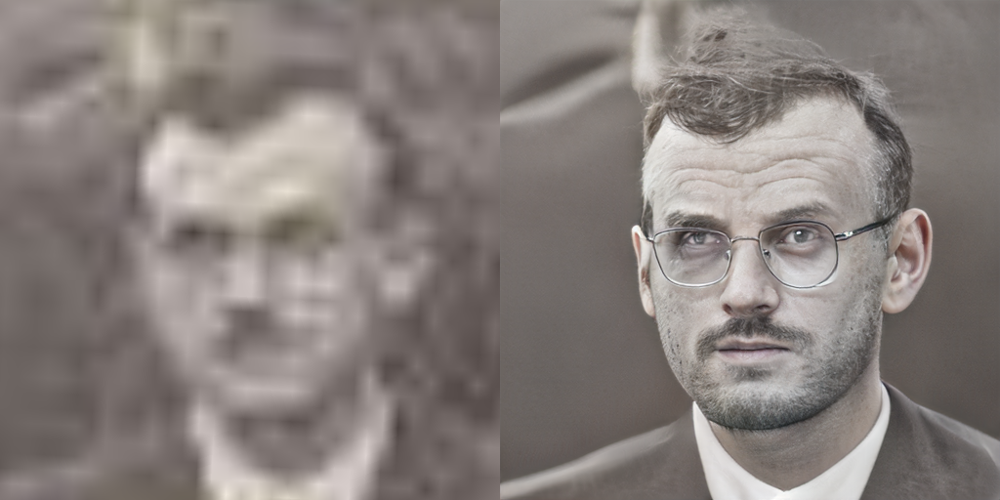
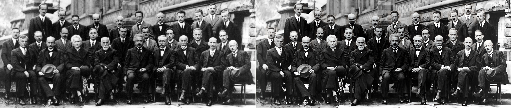
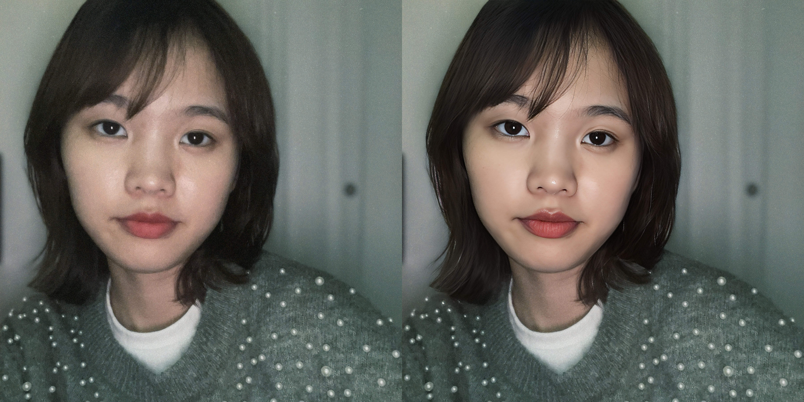
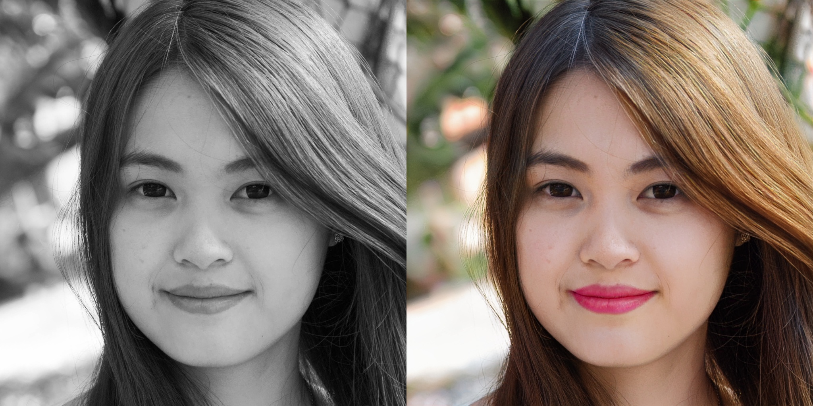
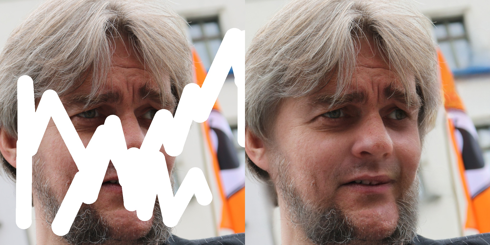
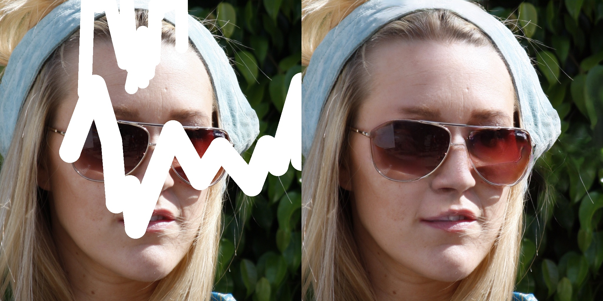
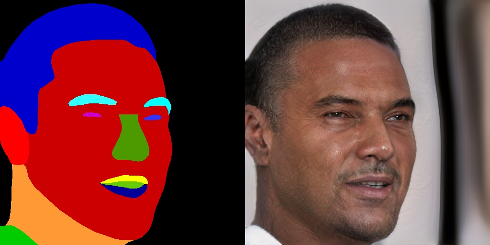
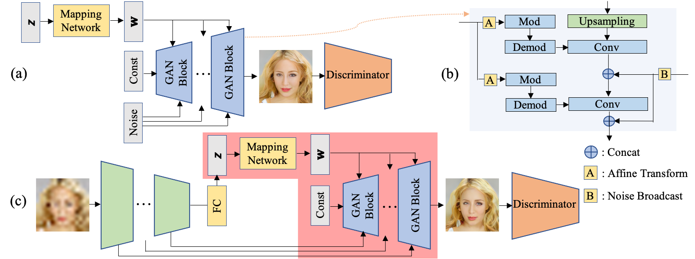

# GAN Prior Embedded Network for Blind Face Restoration in the Wild

[Paper](https://arxiv.org/abs/2105.06070) | [Supplementary](https://www4.comp.polyu.edu.hk/~cslzhang/paper/GPEN-cvpr21-supp.pdf) | [Demo](https://vision.aliyun.com/experience/detail?spm=a211p3.14020179.J_7524944390.17.66cd4850wVDkUQ&tagName=facebody&children=EnhanceFace) | [ModelScope](https://www.modelscope.cn/models/damo/cv_gpen_image-portrait-enhancement/summary)

<a href="https://replicate.ai/yangxy/gpen"></a> [](https://huggingface.co/spaces/akhaliq/GPEN) 

[Tao Yang](https://cg.cs.tsinghua.edu.cn/people/~tyang)<sup>1</sup>, Peiran Ren<sup>1</sup>, Xuansong Xie<sup>1</sup>, [Lei Zhang](https://www4.comp.polyu.edu.hk/~cslzhang)<sup>1,2</sup>  
_<sup>1</sup>[DAMO Academy, Alibaba Group](https://damo.alibaba.com), Hangzhou, China_  
_<sup>2</sup>[Department of Computing, The Hong Kong Polytechnic University](http://www.comp.polyu.edu.hk), Hong Kong, China_

#### Face Restoration

 
 



#### Selfie Restoration

 

#### Face Colorization

 

#### Face Inpainting

 

#### Conditional Image Synthesis (Seg2Face)

 

## News
(2023-02-15) **GPEN-BFR-1024** and **GPEN-BFR-2048** are now publicly available. Please download them via \[[ModelScope2](https://www.modelscope.cn/models/damo/cv_gpen_image-portrait-enhancement-hires/summary)\].

(2023-02-15) We provide online demos via \[[ModelScope1](https://www.modelscope.cn/models/damo/cv_gpen_image-portrait-enhancement/summary)\] and \[[ModelScope2](https://www.modelscope.cn/models/damo/cv_gpen_image-portrait-enhancement-hires/summary)\]. 

(2022-05-16) Add x1 sr model. Add ``--tile_size`` to avoid OOM.

(2022-03-15) Add x4 sr model. Try ``--sr_scale``.
 
(2022-03-09) Add GPEN-BFR-2048 for selfies. <font color='red'>I have to take it down due to commercial issues. Sorry about that.</font>

(2021-12-29) Add online demos <a href="https://replicate.ai/yangxy/gpen"></a> [](https://huggingface.co/spaces/akhaliq/GPEN). Many thanks to [CJWBW](https://github.com/CJWBW) and [AK391](https://github.com/AK391).

(2021-12-16) Release a simplified training code of GPEN. It differs from our implementation in the paper, but could achieve comparable performance. We strongly recommend to change the degradation model.

(2021-12-09) Add face parsing to better paste restored faces back. 

(2021-12-09) GPEN can run on CPU now by simply discarding ``--use_cuda``. 

(2021-12-01) GPEN can now work on a Windows machine without compiling cuda codes. Please check it out. Thanks to [Animadversio](https://github.com/rosinality/stylegan2-pytorch/issues/81). Alternatively, you can try [GPEN-Windows](https://drive.google.com/file/d/1YJJVnPGq90e_mWZxSGGTptNQilZNfOEO/view?usp=drivesdk). Many thanks to [Cioscos](https://github.com/yangxy/GPEN/issues/74).

(2021-10-22) GPEN can now work with SR methods. A SR model trained by myself is provided. Replace it with your own model if necessary.

(2021-10-11) The Colab demo for GPEN is available now <a href="https://colab.research.google.com/drive/1fPUsJCpQipp2Z5B5GbEXqpBGsMp-nvjm?usp=sharing"></a>.

## Download models from Modelscope

- Install modelscope:
```bash
pip install "modelscope[cv]" -f https://modelscope.oss-cn-beijing.aliyuncs.com/releases/repo.html
```

- Run the following codes:
```python
import cv2
from modelscope.pipelines import pipeline
from modelscope.utils.constant import Tasks
from modelscope.outputs import OutputKeys

portrait_enhancement = pipeline(Tasks.image_portrait_enhancement, model='damo/cv_gpen_image-portrait-enhancement-hires')
result = portrait_enhancement('https://modelscope.oss-cn-beijing.aliyuncs.com/test/images/marilyn_monroe_4.jpg')
cv2.imwrite('result.png', result[OutputKeys.OUTPUT_IMG])
```

It will automatically download the GPEN models. You can find the model in the local path ``~/.cache/modelscope/hub/damo``. Please note pytorch_model.pt, pytorch_model-2048.pt are respectively the 1024 and 2048 versions.

## Usage


- Clone this repository:
```bash
git clone https://github.com/yangxy/GPEN.git
cd GPEN
```
- Download RetinaFace model and our pre-trained model (not our best model due to commercial issues) and put them into ``weights/``.

    [RetinaFace-R50](https://public-vigen-video.oss-cn-shanghai.aliyuncs.com/robin/models/RetinaFace-R50.pth) | [ParseNet-latest](https://public-vigen-video.oss-cn-shanghai.aliyuncs.com/robin/models/ParseNet-latest.pth) | [model_ir_se50](https://public-vigen-video.oss-cn-shanghai.aliyuncs.com/robin/models/model_ir_se50.pth) | [GPEN-BFR-512](https://public-vigen-video.oss-cn-shanghai.aliyuncs.com/robin/models/GPEN-BFR-512.pth) | [GPEN-BFR-512-D](https://public-vigen-video.oss-cn-shanghai.aliyuncs.com/robin/models/GPEN-BFR-512-D.pth) | [GPEN-BFR-256](https://public-vigen-video.oss-cn-shanghai.aliyuncs.com/robin/models/GPEN-BFR-256.pth) | [GPEN-BFR-256-D](https://public-vigen-video.oss-cn-shanghai.aliyuncs.com/robin/models/GPEN-BFR-256-D.pth) | [GPEN-Colorization-1024](https://public-vigen-video.oss-cn-shanghai.aliyuncs.com/robin/models/GPEN-Colorization-1024.pth) | [GPEN-Inpainting-1024](https://public-vigen-video.oss-cn-shanghai.aliyuncs.com/robin/models/GPEN-Inpainting-1024.pth) | [GPEN-Seg2face-512](https://public-vigen-video.oss-cn-shanghai.aliyuncs.com/robin/models/GPEN-Seg2face-512.pth) | [realesrnet_x1](https://public-vigen-video.oss-cn-shanghai.aliyuncs.com/robin/models/realesrnet_x1.pth) | [realesrnet_x2](https://public-vigen-video.oss-cn-shanghai.aliyuncs.com/robin/models/realesrnet_x2.pth) | [realesrnet_x4](https://public-vigen-video.oss-cn-shanghai.aliyuncs.com/robin/models/realesrnet_x4.pth)

- Restore face images:
```bash
python demo.py --task FaceEnhancement --model GPEN-BFR-512 --in_size 512 --channel_multiplier 2 --narrow 1 --use_sr --sr_scale 4 --use_cuda --save_face --indir examples/imgs --outdir examples/outs-bfr
```

- Colorize faces:
```bash
python demo.py --task FaceColorization --model GPEN-Colorization-1024 --in_size 1024 --use_cuda --indir examples/grays --outdir examples/outs-colorization
```

- Complete faces:
```bash
python demo.py --task FaceInpainting --model GPEN-Inpainting-1024 --in_size 1024 --use_cuda --indir examples/ffhq-10 --outdir examples/outs-inpainting
```

- Synthesize faces:
```bash
python demo.py --task Segmentation2Face --model GPEN-Seg2face-512 --in_size 512 --use_cuda --indir examples/segs --outdir examples/outs-seg2face
```

- Train GPEN for BFR with 4 GPUs:
```bash
CUDA_VISIBLE_DEVICES='0,1,2,3' python -m torch.distributed.launch --nproc_per_node=4 --master_port=4321 train_simple.py --size 1024 --channel_multiplier 2 --narrow 1 --ckpt weights --sample results --batch 2 --path your_path_of_croped+aligned_hq_faces (e.g., FFHQ)

```
When testing your own model, set ``--key g_ema``.

Please check out ``run.sh`` for more details.

## Main idea
 

## Citation
If our work is useful for your research, please consider citing:

    @inproceedings{Yang2021GPEN,
	    title={GAN Prior Embedded Network for Blind Face Restoration in the Wild},
	    author={Tao Yang, Peiran Ren, Xuansong Xie, and Lei Zhang},
	    booktitle={IEEE Conference on Computer Vision and Pattern Recognition (CVPR)},
	    year={2021}
    }
    
## License
© Alibaba, 2021. For academic and non-commercial use only.

## Acknowledgments
We borrow some codes from [Pytorch_Retinaface](https://github.com/biubug6/Pytorch_Retinaface), [stylegan2-pytorch](https://github.com/rosinality/stylegan2-pytorch), [Real-ESRGAN](https://github.com/xinntao/Real-ESRGAN), and [GFPGAN](https://github.com/TencentARC/GFPGAN).

## Contact
If you have any questions or suggestions about this paper, feel free to reach me at yangtao9009@gmail.com.
